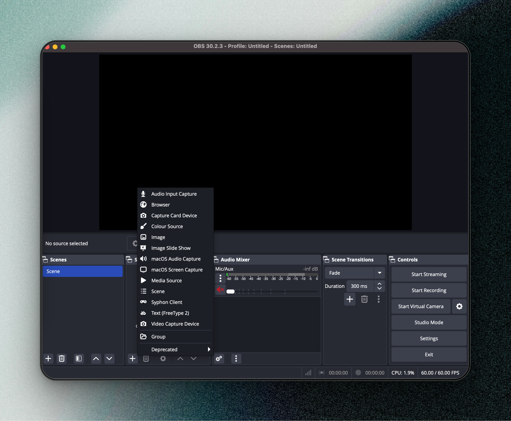
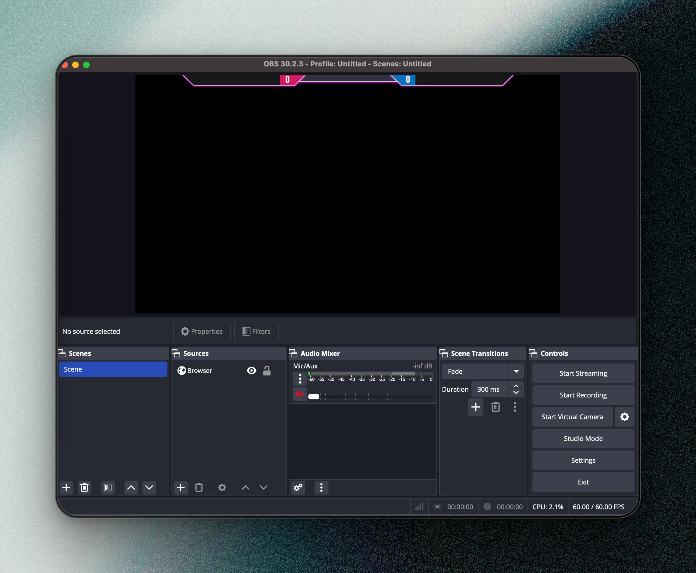

# Trunky Overlay

<!-- vim-markdown-toc GFM -->

- [Installation](#installation)
- [How to use](#how-to-use)
  - [Add to OBS](#add-to-obs)
- [Developer setup](#developer-setup)
  - [Rust](#rust)
  - [Node](#node)
  - [Start development server](#start-development-server)
    - [Install dependency for node](#install-dependency-for-node)
    - [Necessary first build](#necessary-first-build)
    - [Run Svelte dev](#run-svelte-dev)
    - [Run rust server](#run-rust-server)

<!-- vim-markdown-toc -->

Overlay single binary build with Svelte and Rust

## Installation

- Download your OS binary and run, you should see a message that the server had
  been started
- That's it!!!

## How to use

Assume that you are running the server on 0.0.0.0/8080

- Go to localhost:8080/app/scoreboard.html and check if you can see the scoreboard
- Go to localhost:8080/app/control.html and check if you can see the control center

### Add to OBS

- Open your OBS
- Add a browser in your scene
  - Click the plus button
  
  - Choose browser
- Point the link to localhost:8080/app/scoreboard.html
- Size is 1920x1080


You should see the overlay come up



## Developer setup

### Rust

On MacOS / Linux

```bash
curl --proto '=https' --tlsv1.2 -sSf https://sh.rustup.rs | sh
```

On Windows

- Download rustup [here](https://static.rust-lang.org/dist/rust-1.83.0-x86_64-pc-windows-gnu.msi)

### Node

- Use node v18

### Start development server

#### Install dependency for node

```bash
cd static
npm install
```

#### Necessary first build

> [!NOTE]
> To feed the folder static/build for RustEmbed

```bash
npm run build # assume you are in static folder
```

#### Run Svelte dev

```bash
npm run dev # assume you are in static folder
```

#### Run rust server

```bash
cargo run
```

or

```bash
cargo watch -x run

# If you don't have cargo watch
cargo install cargo-watch
```
